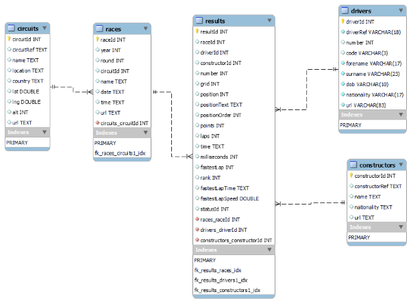

# Formula 1 Anlysis and Visualization with SQL and Python

The goal of this project is to efficiently analyze data from a SQL database containing five related tables: <i>results, races, drivers, constructors,</i> and <i>circuits.</i>

I want to be able to run SQL queries against the database and quickly view the results in either tabular or visual formats--all within this python environment. The workflow will go like this:
<ol>
<li><b>SQLAlchemy</b> will access the database and run our MySQL queries.</li>
<li><b>Pandas</b> will house the results of the query within a dataframe for easy viewing of tabular data.</li>
<li><b>Plotly Express</b> will build interactive plots for our analysis. 
<ul><li><i>Note: For the purposes of making these plots visible on GitHub, I will be saving them in a static png format.</i></li></ul>
</ol>